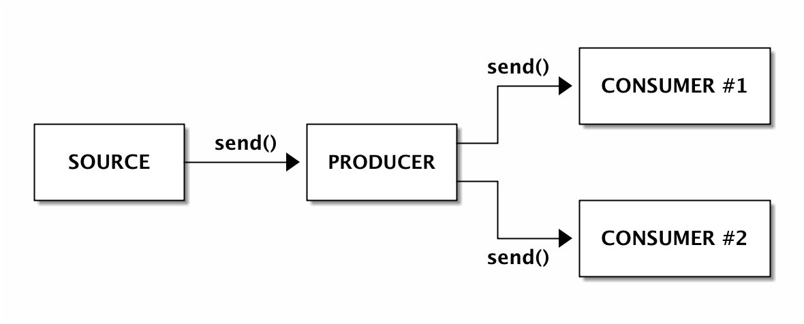

# 协程

Python的协程很像生成器，但并不是生成数据，大多数时候扮演了数据消费者的作用。换句话说，协程是一个在每次使用send方法发送数据后就会被唤醒的函数。

协程的要点是将“yield”关键字写在表达式的右边。下面是一个打印出所发送的值的协程例子：
```
def coroutine():
    print('My coroutine')
    while True:
        val = yield
        print('Got', val)
>>> co = coroutine()
>>> next(co)
My coroutine
>>> co.send(1)
Got 1
>>> co.send(2)
Got 2
>>> co.send(3)
Got 3
```

首先要调用“next”来将协程推进。你可以看到它执行了一个打印。最终，函数进行到“yield”表达式了，然后就会等待唤醒。之后，每次有值被发送过来，协程就会从“yield”处唤醒，将值复制给val并打印出它。
使用`close()`方法可以关闭这个协程。
```
>>> co.close()
>>> co.send(4)
Traceback (most recent call last):
File "<stdin>", line 1, in <module>
StopIteration
```

## 协程部分练习

1. 创建一个名为“square”的协程，它会打印出所发送的值的平方。
2. 创建一个名为“minimize”的协程，它会保存并打印出所发送的值中最小的一个值。

## 管道

协程可以用在部署数据管道中，其中一个协程会发送数据到下一个在数据管道中的协程。协程使用`send()`方法来将数据压入管道。


下面的例子实现了一个小型管道，值会从生产者协程发送到消费者协程打印出来：
```
def producer(consumer):
    print("Producer ready")
    while True:
        val = yield
        consumer.send(val * val)


def consumer():
    print("Consumer ready")
    while True:
        val = yield
        print('Consumer got', val)
```
如前所述，在发送任何数据前都别忘了调用一次“next”。
```
>>> cons = consumer()
>>> prod = producer(cons)
>>> next(prod)
Producer ready
>>> next(cons)
Consumer ready
>>> prod.send(1)
Consumer got 1
>>> prod.send(2)
Consumer got 4
>>> prod.send(3)
Consumer got 9
```

同样的，对于协程来说，数据可以被发送到不同的地方。下面的例子部署了两个消费者，第一个它只会打印0-10之间的内容，第二个则是10-20。
```
def producer(consumers):
    print("Producer ready")
    try:
        while True:
            val = yield
            for consumer in consumers:
            consumer.send(val * val)
    except GeneratorExit:
        for consumer in consumers:
            consumer.close()


def consumer(name, low, high):
    print("%s ready" % name)
    try:
        while True:
            val = yield
            if low < val < high:
                print('%s got' % name, val)
    except GeneratorExit:
        print("%s closed" % name)
```
不要忘了调用下“next”呦。
```
>>> con1 = consumer('Consumer 1', 00, 10)
>>> con2 = consumer('Consumer 2', 10, 20)
>>> prod = producer([con1, con2])
>>> next(prod)
Producer ready
>>> next(con1)
Consumer 1 ready
>>> next(con2)
Consumer 2 ready
>>> prod.send(1)
Consumer 1 got 1
>>> prod.send(2)
Consumer 1 got 4
>>> prod.send(3)
Consumer 1 got 9
>>> prod.send(4)
Consumer 2 got 16
>>> prod.close()
Consumer 1 closed
Consumer 2 closed
```
数据被发送到所有的消费者中，但只有第二个执行了打印命令。注意这里使用的“GeneratorExit”异常。一般都会用捕获异常的方式来通知下游协程这个管道没有用了，赶紧关闭了吧。





## 协程部分练习

1. 部署一个生产者-消费者管道，生产者会将值的平方发送给两个消费者。其中一个会储存并打印出所发送的值中最小的一个，另一个则是最大的一个。

2. 部署一个生产者-消费者管道，生产者会将值的平方发送给两个消费者，一次只发送给其中的一个。第一个值会发送给消费者1号，第二个则会发送给消费者2号，第三个又发送给消费者1号.... 关闭生产者时会强制让消费者打印出它们所接收到的值的列表。


