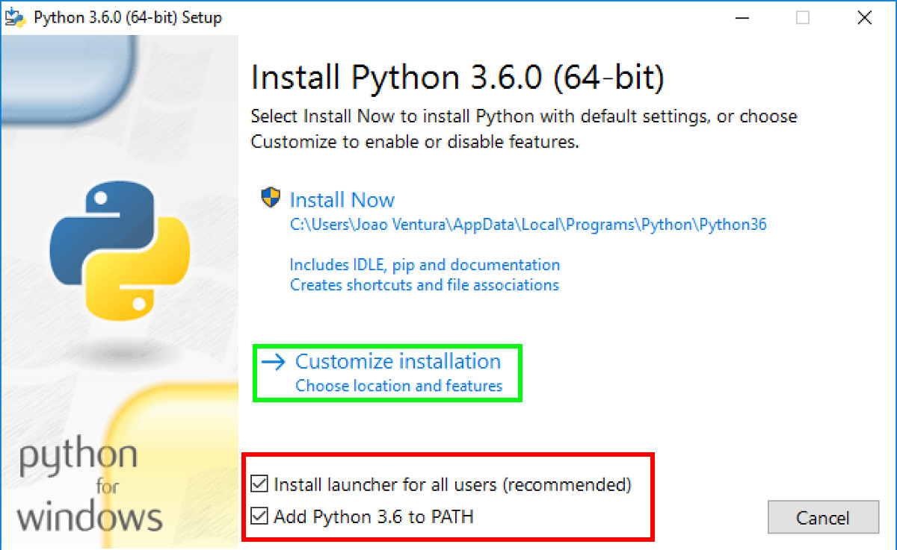
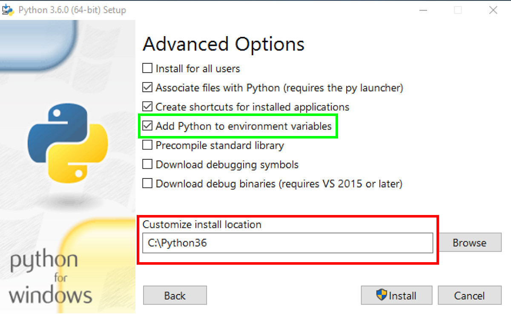
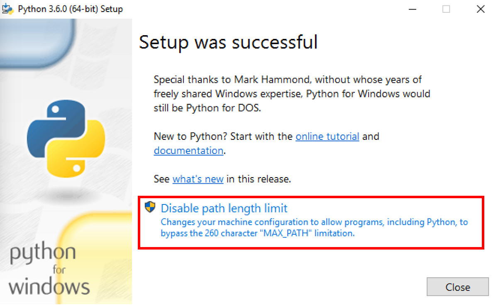
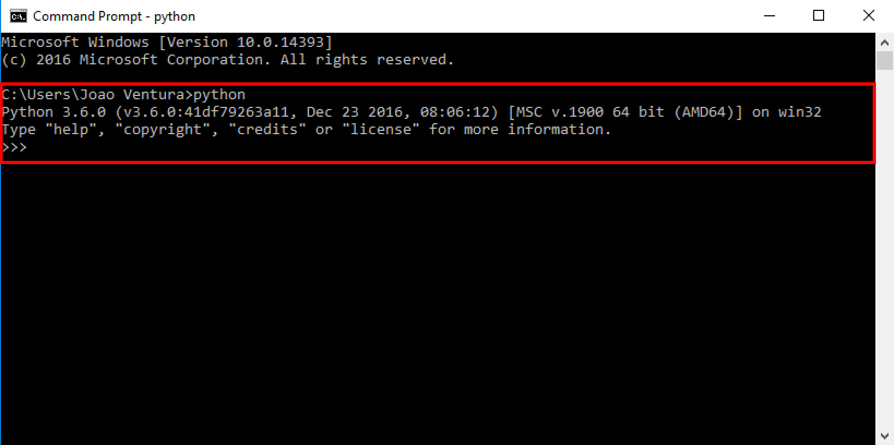
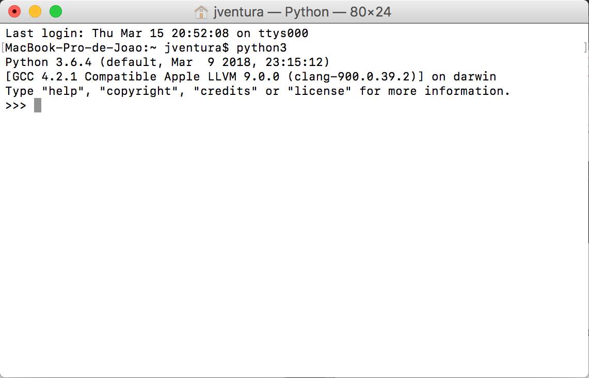
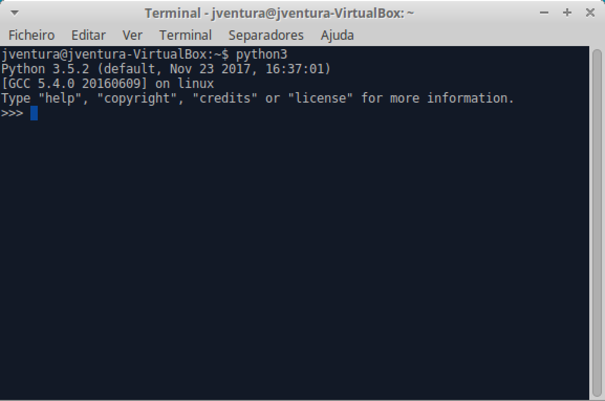

# 安装
本节我们将会安装Python到我们的本地电脑中。

## 在Windows上安装

1. 首先从 https://www.python.org/downloads/windows/ 上选择合适的Python 3版本下载并执行安装。写作本书时最新的版本是3.6.4。

2. 确保勾选了“Install launcher for all users (为所有用户执行安装)”和“Add Python to PATH (将Python添加到环境目录中)”并选择“Customize installation (自定义安装)”。

3. 在下一个视图"Optional Features"中选择需要添加的东西，不过请确保“pip”和“Pylauncher (for all users)”是勾选的。 pip是Python的包管理器，可以让你很方便地安装Python包。

4. 在接下来的“Advanced Options”中确保勾选了"Add Python to enviroment variables"。同时我建议你修改一下安装目录，比如使用“C:\Python36\”，这样在需要时可以很方便得找到Python的安装目录。

5. 最后，允许Python在文件系统上可以超过260个字符，这一条要选择“Disable path length limit (禁用路径长度限制)”并关闭安装对话框。

6. 现在，打开命令行 (cmd)并输出`python`或`python3`。如果安装的过程顺利，那你应该会看到`Python REPL`。`REPL（意思是读取，评估，打印，循环）`是一个允许你编写一些小型Python编码的环境。最后使用`exit()`关掉`REPL`。

## 在macOS上安装
你可以从 https://www.python.org/downloads/mac-osx/ 上选择合适的安装包下载。确保你下载的是最新的Python 3(写作时最新版本是3.6.4)。 同时你可以使用 **Homebrew**（https://brew.sh/） 来进行下载。 
使用**Homebrew**只需要在终端输入`brew install python3`即可。你也可以使用**MacPorts**包管理器（https://www.macports.org/） 进行下载，所需要的命令是`port install python36`。

最后，打开终端并输入`python3`你应该会看到`Python REPL`。按下`Ctrl + D`或输入`exit()`可以退出。

## 在Linux上安装

在Linux上安装Python，你可以在 https://www.python.org//downloads/source/ 中下载最新的Python 3 源码，或者使用包管理器（apt-get, aptitude, synaptic或者其他的）来安装。 之后确保你已经成功安装了Python 3，你可以运行`python3 --version`来查看是否已经安装成功。

最后在终端中输入`python3`你就可以看到Python REPL出现了。 按下`Ctrl + D`或输入`exit()`可以退出。

